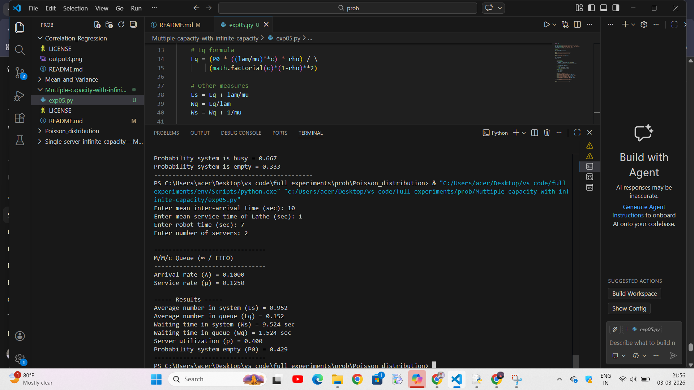

# Multiple server with infinite capacity - (M/M/c):(oo/FIFO)
# DATE :03.03.2026
## Aim :
To find (a) average number of materials in the system (b) average number of materials in the conveyor (c) waiting time of each material in the system (d) waiting time of each material in the conveyor, if the arrival  of materials follow poisson process with the mean interval time 10 seconds, serivice time of two lathe machine follow exponential distribution with mean serice time 1 second and average service time of robot is 7seconds.

## Software required :
Visual components and Python

## Theory:
Queuing are the most frequently encountered problems in everyday life. For example, queue at a cafeteria, library, bank, etc. Common to all of these cases are the arrivals of objects requiring service and the attendant delays when the service mechanism is busy. Waiting lines cannot be eliminated completely, but suitable techniques can be used to reduce the waiting time of an object in the system. A long waiting line may result in loss of customers to an organization. Waiting time can be reduced by providing additional service facilities, but it may result in an increase in the idle time of the service mechanism.


## Procedure :


## Program
```
import math

# INPUTS
arr_time = float(input("Enter mean inter-arrival time (sec): "))
ser_time = float(input("Enter mean service time of Lathe (sec): "))
robot_time = float(input("Enter robot time (sec): "))
c = int(input("Enter number of servers: "))

# Rates
lam = 1/arr_time
mu = 1/(ser_time + robot_time)

print("\n-------------------------------")
print("M/M/c Queue (∞ / FIFO)")
print("-------------------------------")

print(f"Arrival rate (λ) = {lam:.4f}")
print(f"Service rate (μ) = {mu:.4f}")

rho = lam/(c*mu)

if rho < 1:

    # Calculate P0
    summation = 0
    for n in range(c):
        summation += (lam/mu)**n / math.factorial(n)

    last_term = ((lam/mu)**c) / (math.factorial(c)*(1-rho))

    P0 = 1/(summation + last_term)

    # Lq formula
    Lq = (P0 * ((lam/mu)**c) * rho) / \
         (math.factorial(c)*(1-rho)**2)

    # Other measures
    Ls = Lq + lam/mu
    Wq = Lq/lam
    Ws = Wq + 1/mu

    print("\n----- Results -----")
    print(f"Average number in system (Ls) = {Ls:.3f}")
    print(f"Average number in queue (Lq) = {Lq:.3f}")
    print(f"Waiting time in system (Ws) = {Ws:.3f} sec")
    print(f"Waiting time in queue (Wq) = {Wq:.3f} sec")
    print(f"Server utilization (ρ) = {rho:.3f}")
    print(f"Probability system empty (P0) = {P0:.3f}")

else:
    print("WARNING: System unstable (ρ ≥ 1)")

print("-------------------------------")
```

## Output :


## Result : 
Hence the problem solved and the output is obtained successfully using Python
